# gitleash

[](https://github.com/calvinsyy/gitleash/actions/workflows/ci.yml)
[](https://www.npmjs.com/package/gitleash)
[](./LICENSE)

**Keep your AI coding agent on a leash.** A zero-config git guardrail that stops
reckless agent commits — huge diffs, deleted tests, hardcoded secrets, CI edits —
and force-pushes to `main` *before they land*. Works with Claude Code, Cursor,
aider, Codex, or a human on a bad day. It's just a git hook, so it fires no matter
who (or what) made the change.



## Why

You hand an AI agent your repo and walk away. It comes back having deleted the
failing test instead of fixing it, regenerated your lockfile, hardcoded an API
key, and rewritten 600 lines across 30 files — all staged, ready to commit.

`gitleash` is a pre-commit tripwire tuned for exactly that. When a staged commit
crosses a danger line, it stops the commit and tells you why. Nothing is blocked
silently; every block is one env var away from an override.

## Quick start

```bash
npm i -g gitleash        # or: npm i -D gitleash
cd your-repo
gitleash install         # writes pre-commit + pre-push hooks (once per repo)
```

That's it. The next time an agent tries a reckless commit, it gets stopped:

```
gitleash — 2 blocking issues, 0 warnings

  ✖ protect-tests  Test file deleted: app.test.ts. Agents sometimes "fix" failing
                   tests by removing them — confirm this is intentional.
  ✖ secrets        Possible AWS access key in the staged changes.

Commit blocked. If this is intentional, override with:
  GITLEASH_OK=1 git commit ...      (or: git commit --no-verify)
```

## The default rules (tuned for autonomous agents)

| Rule | Severity | Fires when |
| --- | --- | --- |
| `big-diff` | block | > 400 changed lines, or > 25 changed files, in one commit |
| `protect-tests` | block | a test file is deleted |
| `protect-ci` | block | a `.github/workflows/*` or other CI file changes |
| `secrets` | block | staged content matches a secret pattern (AWS/GitHub/OpenAI keys, private keys, hardcoded credentials) |
| `lockfile-drift` | warn | a lockfile changes without its `package.json` |
| `protected-branch` | warn | you commit directly to `main` / `master` |
| `force-push` | block | a force-push (history rewrite) to a protected branch — via the pre-push hook |
| `protected-branch-push` | block | deleting a protected branch — via the pre-push hook |

Blocks stop the commit (or push); warnings just print. Auto-generated files
(lockfiles, bundles, `dist/`) don't count toward `big-diff`. Every threshold and
severity is configurable.

## Configuration

Zero config works out of the box. To tune, run `gitleash init` and edit
`.gitleash.json` (or add a `gitleash` key to `package.json`):

```json
{
  "maxLines": 400,
  "maxFiles": 25,
  "protectTests": true,
  "protectCi": true,
  "scanSecrets": true,
  "warnLockfileDrift": true,
  "protectedBranches": ["main", "master"],
  "disabledRules": [],
  "ruleSeverity": { "protect-ci": "warn" }
}
```

`disabledRules` turns rules off entirely; `ruleSeverity` re-grades a rule
(e.g. downgrade `protect-ci` from `block` to `warn`) instead of disabling it.

## Commands

| Command | What it does |
| --- | --- |
| `gitleash install` | Install the pre-commit + pre-push hooks (coexists with existing hooks) |
| `gitleash check` | Check the staged diff — what the pre-commit hook runs |
| `gitleash check --range main..HEAD` | Check a commit range instead (handy in CI) |
| `gitleash check --json` | Emit findings as JSON (for CI dashboards) |
| `gitleash init` | Write a `.gitleash.json` you can tune |
| `gitleash uninstall` | Remove the hooks |

### Use in CI

```yaml
# .github/workflows/gitleash.yml
- run: npx gitleash check --range origin/main...HEAD
```

## How it works

`gitleash install` writes a `pre-commit` hook (runs `gitleash check`) and a
`pre-push` hook (runs `gitleash pre-push`). On commit, `gitleash` reads the
**staged** diff (`git diff --cached`), runs the rules, and exits non-zero if
anything blocks — which aborts the commit. On push, it inspects the refs git
feeds the hook and blocks force-pushes / deletions of protected branches. If a
hook already exists, gitleash appends its block so the two coexist.

It never phones home, never uploads your code, and adds no runtime dependency to
your project beyond `git` itself.

## Overriding

A block is a speed bump, not a wall. When you've reviewed the change and it's fine:

```bash
GITLEASH_OK=1 git commit -m "..."   # gitleash allows it and notes the override
git commit --no-verify -m "..."     # skips all git hooks entirely
```

To silence a **secret false-positive on a single line**, mark it inline — the
rest of the commit is still checked:

```js
const publishableKey = "pk_live_notreallyasecret"; // gitleash-allow
```

The `big-diff` rule never fires on a repo's **first commit** (bootstrapping a
project is legitimately large).

## Origin story

The very first time I pushed gitleash to GitHub, the push was **rejected** —
GitHub's own secret scanner found two "API keys" in the test fixtures and blocked
me. They were fake, of course, but real-looking enough to trip the scanner.

Which is exactly the point. A check that catches secrets — and huge diffs, deleted
tests, force-pushes — is something you want *on your own machine, before the push*,
for every rule, not only for secrets and not only when a server happens to notice.
`gitleash` is that check: local, zero-config, firing on every commit and push.

## Requirements

- Node ≥ 18
- `git` on your PATH

## Changelog

See [CHANGELOG.md](./CHANGELOG.md).

## License

MIT
